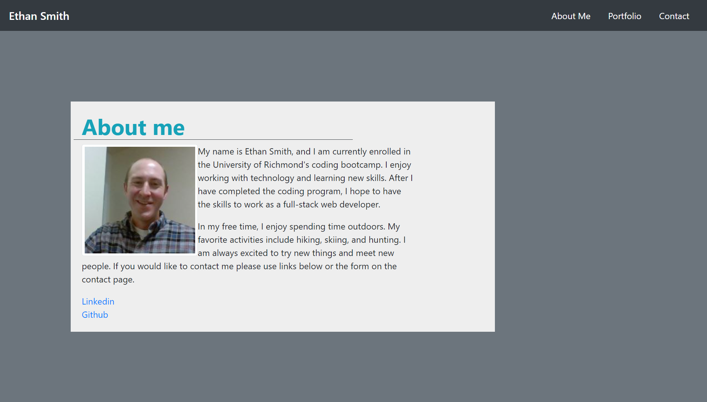
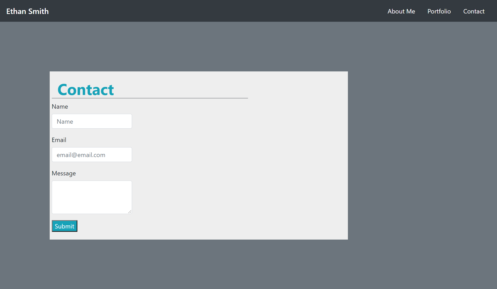

# portfolio
Portofolio Site

Technology used:
HTML 5
CSS 3
Javascript/JQuery

For this project, I created a responsive website that acts as space to tell others about myself and showcase projects that I have been working on. The site was created from scratch, but used Bootstrap elements to create the content and the Bootstap grid system to lay out the design. This allows the website to be responsive to different sizes of screens and maintain a pleasing appearance no matter which device the user is on. I gained a better understanding of both Bootstrap and the grid system during this project as well as experience linking multiple pages together with a navigation bar. Overall, this was a challenging project, but I was able to deploy a function website with an about me section, portfolio page that links to past projects, and contact page. 

The Repository for this site with all commits can be found at:
https://github.com/ejsmith13/portfolio

The deployed site can be found at:
https://ejsmith13.github.io/portfolio/

I am including the following screenshots of the finished site:

Copyright (c) 2021 Ethan Smith

Permission is hereby granted, free of charge, to any person obtaining a copy
of this software and associated documentation files (the "Software"), to deal
in the Software without restriction, including without limitation the rights
to use, copy, modify, merge, publish, distribute, sublicense, and/or sell
copies of the Software, and to permit persons to whom the Software is
furnished to do so, subject to the following conditions:

The above copyright notice and this permission notice shall be included in all
copies or substantial portions of the Software.

THE SOFTWARE IS PROVIDED "AS IS", WITHOUT WARRANTY OF ANY KIND, EXPRESS OR
IMPLIED, INCLUDING BUT NOT LIMITED TO THE WARRANTIES OF MERCHANTABILITY,
FITNESS FOR A PARTICULAR PURPOSE AND NONINFRINGEMENT. IN NO EVENT SHALL THE
AUTHORS OR COPYRIGHT HOLDERS BE LIABLE FOR ANY CLAIM, DAMAGES OR OTHER
LIABILITY, WHETHER IN AN ACTION OF CONTRACT, TORT OR OTHERWISE, ARISING FROM,
OUT OF OR IN CONNECTION WITH THE SOFTWARE OR THE USE OR OTHER DEALINGS IN THE
SOFTWARE.