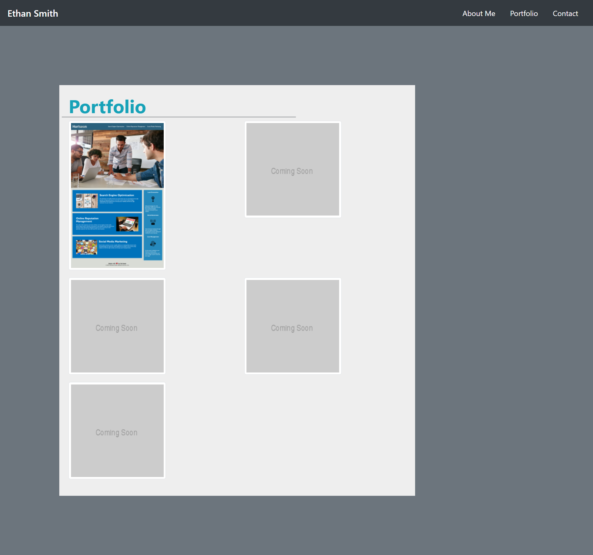

# portfolio
Portofolio Site

For this project, I created a responsive website that acts as space to tell others about myself and showcase projects that I have been working on. The site was created from scratch, but used Bootstrap elements to create the content and the Bootstap grid system to lay out the design. This allows the website to be responsive to different sizes of screens and maintain a pleasing appearance no matter which device the user is on. I gained a better understanding of both Bootstrap and the grid system during this project as well as experience linking multiple pages together with a navigation bar. Overall, this was a challenging project, but I was able to deploy a function website with an about me section, portfolio page that links to past projects, and contact page. 

The Repository for this site with all commits can be found at:
https://github.com/ejsmith13/portfolio

The deployed site can be found at:
https://ejsmith13.github.io/portfolio/

I am including the following screenshots of the finished site:

